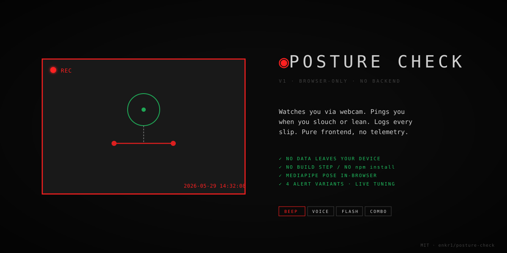

<p align="center">
  
</p>

<p align="center">
  <a href="LICENSE"></a>
  
  
  
  
</p>

# Posture Check

Webcam to MediaPipe Pose to alerts when you slouch or lean. Pure frontend. No backend, no build step, no data leaves your device.

> **v1 prototype.** Logic and UX are stable enough to use daily; some roadmap items (auto-calibration, head-turn detection) are deliberately out of scope. See [Limitations](#limitations).

## Why

Sitting eight hours a day destroys your back. Most posture tools need a wearable (Lumo, Upright Go) or a cloud service. This one runs entirely in your browser using your existing webcam. Open the tab, click CALIBRATE while sitting upright, and it beeps when you slip.

## Quick start

```bash
git clone https://github.com/enkr1/posture-check
cd posture-check
./start.sh
```

Or any local HTTP server:

```bash
python3 -m http.server 8000
# open http://localhost:8000
```

`getUserMedia` requires a secure context, so `file://` will not work. You need a local server (or HTTPS deployment).

## How it works

1. Click **CALIBRATE** while sitting upright. Baseline (nose Y + shoulder tilt) is captured to `localStorage`.
2. MediaPipe Pose runs at 5 fps in-browser and watches your nose and shoulders every frame.
3. When you slouch forward or lean sideways for 2+ seconds, the active alert fires.
4. The log records every event with timestamp, type, duration, and outcome (`corrected` / `corrected-slow` / `ignored`).

The live `F:` and `L:` readouts next to the sensitivity slider show your current forward and lateral deltas. Use them to tune the slider visually instead of guessing.

## Alert variants

Switch via the bottom bar or URL param: `?alert=beep|voice|flash|combo`

| Variant | Mechanism | Best for |
|---|---|---|
| `beep` | 800Hz Web Audio tone, 200ms | General use |
| `voice` | `speechSynthesis` ("Sit up" / "Lean left" / "Lean right") | Direct nudging |
| `flash` | Camera frame flashes red | Silent environments (office, library) |
| `combo` | All three at once | Maximum nudge |

## Privacy

- Video frames are processed by MediaPipe in-browser via WASM/WebGL.
- **No frames, no keypoints, no detection data of any kind leave your device.**
- Baseline + event log are stored in `localStorage`, scoped per-origin. Clear site data to wipe.
- No analytics, no telemetry, no third-party fonts or icons fetched at runtime.
- The only network requests are CDN fetches of MediaPipe Tasks Vision on first load.

## Browser support

| Browser | Status |
|---|---|
| Chrome / Edge / Brave | ✓ Tested |
| Safari | ✓ Should work (Web Audio + WebGL supported since 15) |
| Firefox | ✓ Should work |
| Mobile | ⚠ Untested. Pose model is CPU-heavy on mobile |

Requires `getUserMedia`, MediaPipe Tasks Vision, Web Audio, Speech Synthesis. All available in evergreen browsers since ~2022.

## Project structure

```
posture-check/
├── index.html       Markup: header + cam + stats + log + footer
├── style.css        Surveillance-themed UI (font tokens, overlay pseudos, slider)
├── app.js           State machine + MediaPipe pipeline + alert dispatcher (DOM plumbing)
├── posture.js       Pure detection logic — classify, deltas, formatting (no DOM)
├── posture.test.js  Tests for posture.js (node:test, zero dependencies)
├── package.json     ESM flag + `npm test` script (no runtime dependencies)
├── start.sh         Local server launcher (macOS — open + lsof)
├── docs/
│   └── hero.svg     README hero image
├── README.md
├── LICENSE          MIT
└── .gitignore
```

The detection logic lives in `posture.js` — pure functions (`classifyPosture`, `computeDeltas`, `formatDuration`) with no DOM or time dependency, which is exactly why they are unit-tested. `app.js` is the state machine (`tick` does temporal debouncing, outcome measurement, event logging) plus all the UI plumbing.

## Development

No build step and no runtime dependencies. Tests use Node's built-in test runner (Node 18+):

```bash
npm test
```

Only the pure logic in `posture.js` is tested — the threshold boundaries and lean-direction signs are where sensitivity tuning is most likely to introduce regressions. The UI is verified by hand in the browser.

## Sensitivity tuning

The slider sets the forward-slouch threshold (0.015 to 0.20). Lateral lean uses 60% of that threshold (shoulders move less than the head during natural movement, so the lateral threshold should be tighter).

To tune:

1. Sit how you want detection to consider "good".
2. Click CALIBRATE.
3. Watch the `F:` and `L:` readouts as you adjust your posture.
4. Move the slider so your typical posture stays under threshold and your slouch clearly crosses it.

The slider position persists across reloads. Calibration baseline persists too.

## Accessibility

- `aria-live="polite"` on the status indicator. State changes (OK / PENDING / BAD) are announced by screen readers.
- `aria-pressed` reflects the active alert variant.
- `@media (prefers-reduced-motion: reduce)` disables the surveillance pulse, sync bar, and noise animations for users with vestibular sensitivity. The look is preserved; only the motion is removed.

## Limitations

- **Calibration is manual.** You click a button while sitting upright. Auto-capture on first stable pose is on the roadmap.
- **Webcam pose detection is not as accurate as a wearable IMU.** Subtle slouching that does not move your head will not trigger.
- **5 fps detection.** A trade-off between battery and responsiveness. Not real-time.
- **Distraction detection (head turn) and gaze tracking are explicitly out of scope.** They are separate products, not features.
- **Calibration assumes a fixed camera position.** Move your laptop and you should recalibrate.

## Roadmap

- Auto-capture baseline on app open (5-second stable pose window) instead of manual click
- README screenshot / animated GIF replacing the SVG hero
- GitHub Pages live demo
- `start.sh` cross-platform (`xdg-open` for Linux, `start` for Windows)
- Speech synthesis i18n (currently English-only)
- Optional shoulder-slope-only mode for users who do not slouch but lean

## Contributing

Issues and PRs welcome. Especially:

- Cross-platform launcher fixes (`start.sh` is macOS-only today)
- Mobile testing reports
- Browser compatibility data
- New alert variants

Keep changes minimal and ASCII-comment the WHY when behaviour is non-obvious.

## License

[MIT](LICENSE) © 2026 Jing Hui Pang
